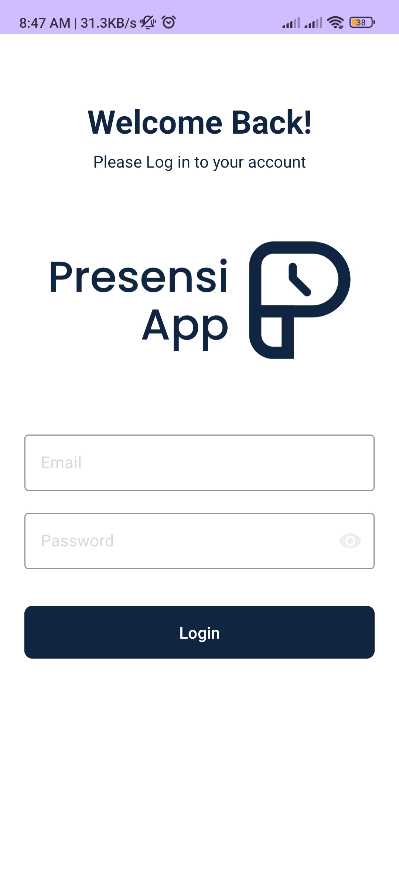
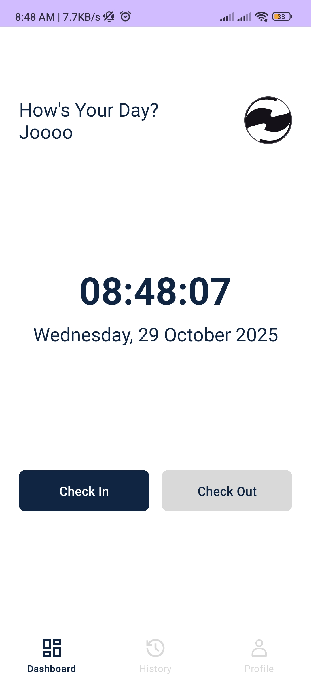
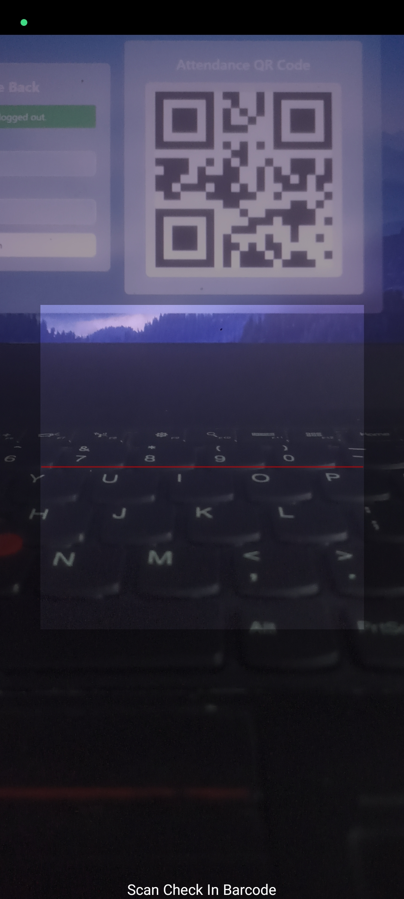
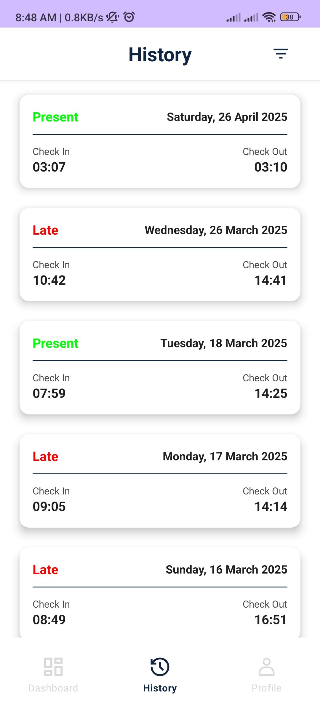
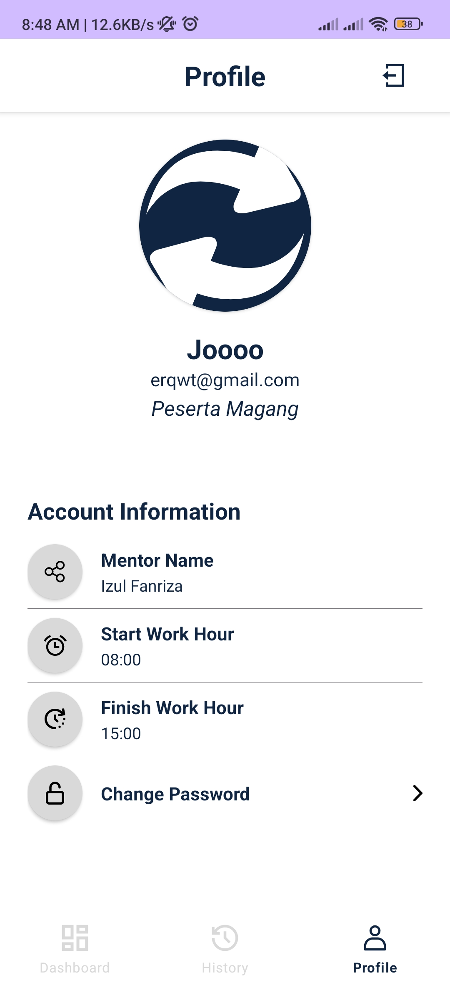

SISTEM INFORMASI PRESENSI MAGANG - ANDROID APP  
*(Intern Attendance Information System - Mobile Application)*  

---

### Description
This Android application is designed for the Intern Attendance Information System. The app enables interns to mark their attendance 
through daily changing QR codes, while providing mentors with real-time access 
to monitor their interns' attendance records.

---

### Key Features  

#### For Interns (Peserta Magang)
1. **Login with Account**  
   - Authentication with username/email and password  
   - Session management with token  
   - Logout functionality  

2. **Scan QR Code**  
   - Daily QR code scanning for check-in and check-out  
   - Real-time attendance status updates  
   - Error handling for failed scans  

3. **Automatic Attendance Status**  
   -  **PRESENT:** Check-in before or at work hour  
   -  **LATE:** Check-in after work hour  

4. **Attendance History**  
   - View complete attendance records  
   - Displays date, check-in, check-out, and status  
   - Sort by date (newest/oldest)  

5. **User Profile**  
   - Profile photo upload/change  
   - Display intern name, mentor name  
   - Work hour start/end time (set by mentor)  
   - Contact information  

---

#### For Mentors (Pembimbing)
1. **Login with Account**  
   - Authentication with username/email and password  
   - Session management with token  

2. **Intern List**  
   - View all interns assigned to the mentor  
   - Quick access to each intern’s attendance history  

3. **Intern Details**  
   - View detailed attendance history (date, check-in, check-out, status)  

---

### Technology Stack
| Category | Tools |
|-----------|--------|
| **Programming Language** | Kotlin |
| **Platform** | Android Native |
| **HTTP Client** | Retrofit |
| **Async Operations** | Kotlin Coroutines |
| **QR Code Scanner** | ZXing Embedded |
| **Image Loading** | Glide |
| **Local Storage** | SharedPreferences |

---

### Preview

  
  
  

  
  

---
